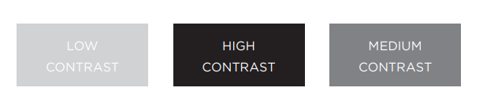

# CSS


**CSS** allows you to create rules that specify how the content of an element should appear 

**BLOCK & INLINE ELEMENTS**
* Block level elements look like they start on a new line. 
* Inline elements flow within the text and do not start on a new line. 

A CSS **rule** contains two parts:
* **Selectors** : indicate which element the rule applies to.

    `note : The same rule can apply to more than one element. `

* **Declarations** : indicate how the elements referred to in the selector should be styled.
Declarations are split into two parts (**property and a value**), and are separated by a colon.


> Note : CSS rules usually appear in a separate document, although they may appear within an HTML page.


# COLOR

Colors are specified using predefined color names, or RGB, HEX, HSL, RGBA, HSLA values.


**More properties can be added to the colors :**

1. **Hue** : the degree to which a stimulus can be described as similar to or different from stimuli that are described as red, orange, yellow, green, blue, purple.
2. **Saturation** : refers to the amount of gray in a color. 
3. **Brightness** : how much black is in a color.


4. **Contrast** : If text is reversed out (a light color on a dark background), you can increase the height between lines and the weight of the font to make it easier to read.



5. **opacity, rgba** : allows you to
specify the opacity of an element and any of its child elements.
The value is a number between 0.0 and 1.0 .

```
p.one {
background-color: rgb(0,0,0);
opacity: 0.5;}
```
**OR**
```
p.two {
background-color: rgba(0,0,0,0.5);}
```
**Go back -->** [Reading Notes](https://aseel-dweedar.github.io/reading-notes/)