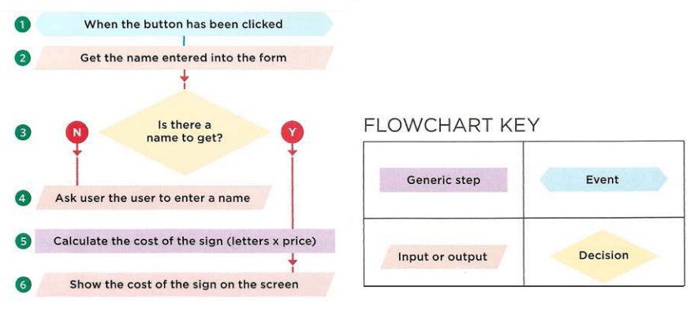

# HTML


## - Structure:

**Structure** helps readers understand the content, For example, a document might start with a large heading, followed by an introduction or the most important information.

**HTML code** is made up of characters that live inside angled brackets — these are called HTML elements. Elements are usually made up of two tags: an opening tag and a closing tag.

`EX:\<h1> and \</h1>`

> **Note that:**
> The closing tag has an extra forward slash in it.

**Attributes** provide additional information about the contents of an element. They appear on the opening tag of the element and are made up of two parts: a name and a value, separated by an equals sign.

> **Note that:**
> The value is the information or setting for the attribute. It should be placed in double quotes

**Body, Head & Title**

```HTNL
<!DOCTYPE html>
<html>
  <head>
    <title> Page Title </title>
  </head>

  <body>
    <h1> First Heading </h1>
    <p> first paragraph </p>
  </body>
</html>
```

<br>

## - Extra Markup :

- If you want to add a **comment** to your code that will not be visible in the user's browser, you can add the text between these characters:

  `<!-- comment goes here -->`

- **id attribute & class attribute** used to uniquely identify that element from other elements on the page :

  `<p id="pullquote">`

  `<p class="important">`

- **\<div>** element allows you to group a set of elements together in one block-level box.

- The **\<span>** element acts like an inline equivalent of the \<div> element. It is used to either:

  1.  Contain a section of text where there is no other suitable element to differentiate it from its surrounding text.
  2.  Contain a number of inline elements.

- **\<iframe>** An iframe is like a little window that has been cut into your page — and in that window you can see another page. The term iframe is an abbreviation of inline frame.

- Escape characters are used to include special characters in your pages such as: <, >, and ©.

<br>

## - HTML5 Layout:

**HTML5 introduces a new set of elements that allow you to divide up the parts of a page.**

- **Headers & Footers** `<header> <footer>`: The main header or footer that appears at the top or bottom of every page on the site.

- **Navigation** `<nav>`: used to contain the major navigational blocks on the site such as the primary site navigation.

- **Articles** `<article>`: container for any section of a page that could stand alone and potentially be syndicated.

- **Article** `<aside>`:

  - When the `<aside>` element is used inside an `<article>` element, it should contain information that is related to the article but not essential to its overall meaning.

  - When the `<aside>` element is used outside of an `<article>` element, it acts as a container for content that is related to the entire page.

- **Sections**: The `<section>` element groups related content together, and typically each section would have its own heading.

- **Heading groups** `<hgroup>`: s to group together a
  set of one or more `<h1>` through `<h6>` elements so that they are treated as one single heading.

- **Figures** `<figure> <figcaption>`: to contain any content that is referenced from the main flow of an article.

- **Sectioning Elements** `<div>`: to group together related elements.

- **Linking Around Block-Level Elements**: Place an `<a>` element around a block level element that contains child elements. This allows you to turn an entire block into a link.

<br>

## - Process & Design

1. Study your audience.
2. Site Maps, organize the information into sections or pages.
3. Create WireFrame, It shows the hierarchy of the information and how much space it might require.
4. Study the elements of design, Organizing and prioritizing information on a page helps users understand its importance and what order to read it in.

# **JS**


## - WHAT IS A SICRIPT AND HOW TO WRITE IT

A script is a series of instructions that a computer can follow to achieve a goal.

**To write a script**

1. DEFINE THE GOAL.
2. DESIGN THE SCRIPT.
3. CODE EACH STEP.

**To design the secript**
You can use flowcharts to work out how the tasks fit together. The flowcharts show the paths between each step.



## - How do computers fit in the world around them

**OBJECTS** In computer programming, each physical thing in the world can be represented as an object.

**CHARACTERISTICS** is properties in these objects.

**WHAT DOES AN EVENT DO?**
Programmers choose which events they respond to.
When a specific event happens, that event can be
used to trigger a specific section of the code.

Scripts often use different events to trigger different
types of functionality.
So a script will state which events the programmer
wants to respond to, and what part of the script
should be run when each of those events occur.

**WHAT DOES A METHOD DO?**
The code for a method can contain lots of
instructions that together represent one task.

### **PUTTING IT ALL TOGETHER**

Computers use data to create models of things in the real world. The events, methods, and properties of an object all relate to each other: Events can trigger methods, and methods can retrieve or update an object's properties.

**HOW A BROWSER SEES A WEB PAGE** r to understand how you can change the content of an HTML page using JavaScript, you need to know how a browser interprets the HTML code and applies styling to it.

- RECEIVE A PAGE AS HTML CODE.
- CREATE A MODEL OF THE PAGE AND STORE IT IN MEMORY.
- USE A RENDERING ENGINE TO SHOW THE PAGE ON SCREEN.

All major browsers use a JavaScript interpreter to translate your instructions (in JavaScript) into instructions the computer can follow.

<br>
<hr>

**Article sources**

- HTML & CSS Design and Build Websites / Jon Ducket

- JavaScript and jQuery Interactive / Jon Ducket

**Go back -->** [Reading Notes](https://aseel-dweedar.github.io/reading-notes/)
