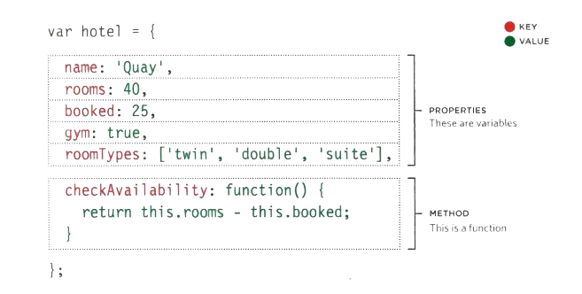
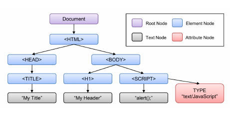

# Problem Domain

- **What is the hardest thing about writing code?**
- **Why problem domains are hard?**
- **How to make Programming easy?**

**The** hardest thing about programming is learning the problem domain. **familiarity** with problem domain can move the focus from problem domain and put instead on the technology.

**Many** of the problem domains we face as programmers are difficult to understand and look completely different depending on your viewpoint. **programmers** also are often not given complete information about the problem domain, so they don’t even have the information we need to understand it

**When** you are essentially given the entire problem domain in the form of a spec that was clear and unambiguous. You are easily able to learn that problem domain and because of it, You be able to write the code very easily as well.

<br>

# OBJECT-JS

In JavaScript, almost "everything" is an object.

Objects group together a set of **variables** and **functions** to create a model of a something you would recognize from the real world. In an object,
variables and functions take on new names.

- IN AN OBJECT: VARIABLES BECOME KNOWN AS **PROPERTIES**.
- IN AN OBJECT: FUNCTIONS BECOME KNOWN AS **METHODS**.



You access the proprties or methods of an object using dot notation. and you can also acces properties using square brackets.


# Document Object Model (DOM)

As a browser loads a web page, it creates a model of that page.
The model is called a **DOM tree**, and it is stored in the browsers' memory.
It consists of four main types of **nodes**.



Scripts access and update this DOM tree (not the source HTML file).
Any changes made to the DOM tree are reflected in the browser.

## Caching DOM queries

Methods that find elements in the DOM tree are called **DOM queries**. when you need to work with an element more than ones, you should use a variable to store the result of the queriy.

```
getElementById('one')

let itemOne = getElementById('one')
```

DOM queries may return one element, or they may return a Nodelist, which is a collection of nodes.

**METHODS THAT RETURN A SINGLE ELEMENT NODE:**

- getElementByld('id')
- querySelector('css selector')


**METHODS THAT RETURN ONE OR MORE ELEMENTS:**

- getElementsByClassName('class')
- getElementsByTagName('tagName')
- querySelectorAll ('css select or')


## Repeating actions for an entire nodelist

```
let  shortItems = document .querySelectorAll('li. short') ;
if (shortItems.length > 0) {
for (let  i=0; i<shortItems.length; i++) {
shortItems[i] .className = 'tall' ;
}
}
```

In this example, the Nodelist is generated using querySelectorAll(),and it is looking for any `<li>` elements that have a class attribute whose value is short.

The Nodelist is stored in a variable called shortItems, and the number of elements in the list is found using the length property. For each of the elements in the Nodelist, the value of the class attribute is changed to tall.

## TRAVERSING THE DOM

When you have an element node, you can select another element in relation to it using these five properties:

- parentNode.
- previousSibling.
- nextSibling.
- firstChild.
- lastChild.

> Traversing the DOM can be difficult because some browsers add a text node whenever they come across whitespace between elements.

## Adding or removing HTML content

1. the innerHTML property.
2. DOM manipulation methods.

There are asecurity risks associated with using **innerHTML**.
**DOM manipulation** can be safer than using innerHTML, But it requires more code and be slower.

## Attribute nodes

Once you an element node, you can use other properties and methods on that element node to access and change its attributes.
There are two steps to accessing and update attributes:

1. select the element node that carries the attribute and follow it with a period symbol.
2. use one of the methods or properties to work with that element's attributes.
   - **Method**:
     - getAttribute()
     - hasAttribute()
     - setAttribute()
     - removeAttribute()
   - **Prorety**: className, id.

<hr>
<br>

**Article sources**

- HTML & CSS Design and Build Websites / Jon Ducket

- Understanding The Problem Domain Is The Hardest Part Of Programming / John Sonmez

**Go back -->** [Reading Notes](https://aseel-dweedar.github.io/reading-notes/)
