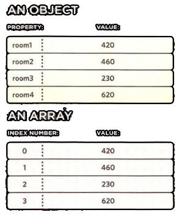
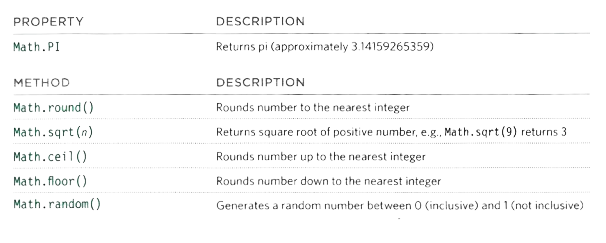

# TABLES -HTML


**tables** represents information in a grid format.
Grids allow us to understand complex data by referencing information on two axes.

Each block in the grid is referred to as a **table cell**. In HTML a table is written out row by row.

## Basic Table Structure

``` HTML
<table>
 <tr>
 <td>Cell1</td>
 <td>Cell2</td>
 <td>Cell3</td>
 </tr>
 <tr>
 <td>Cell4</td>
 <td>Cell5</td>
 <td>Cell6</td>
 </tr>
 </table>
 ```
**The result is:**
<table>
 <tr>
 <td>Cell1</td>
 <td>Cell2</td>
 <td>Cell3</td>
 </tr>
 <tr>
 <td>Cell4</td>
 <td>Cell5</td>
 <td>Cell6</td>
 </tr>
 </table>

`<table>` element is used to create a table.

`<tr>` tag indicates the start of each row.

`<td>` Each cell of a table is represented using this element. 

## Table Headings

`<th>` The `<th>` element is used just like the `<td>` element but its purpose is to represent the heading for either a column or a row. (The th stands for table heading).
``` html
<table>
 <tr>
 <th></th>
 <th>col1</th>
 <th>col2</th>
 </tr>
 <tr>
 <th>row1</th>
 <td>1</td>
 <td>2</td>
 </tr>
<tr>
 <th>row2</th>
 <td>3</td>
 <td>4</td>
 </tr>
</table>
```
**The result is:**
<table>
 <tr>
 <th></th>
 <th>col1</th>
 <th>col2</th>
 </tr>
 <tr>
 <th>row1</th>
 <td>1</td>
 <td>2</td>
 </tr>
<tr>
 <th>row2</th>
 <td>3</td>
 <td>4</td>
 </tr>
</table>
<br>

## Spanning Columns & Rows

when you need the entries in a table to be stretched across more than one column or row:

 * colspan attribute can be used on a `<th>` or `<td>` element and indicates how many columns that cell 
should run across.

    `<td colspan="2">Colum</td>`

* The rowspan attribute can be used on a `<th>` or `<td>` element to indicate how many rows a cell should span down the table.

    `<td colspan="2">Row</td>`


## Long Tables

There are three elements that help distinguish between the main content of the table and the first and last rows:

`<thead>` The headings of the table should
sit inside the `<thead>` element.

`<tbody>`
The body should sit inside the `<tbody>` element.

`<tfoot>`
The footer belongs inside the `<tfoot>` element.

<br>

# OBJECTS -JS

To **UPDATE** the value of proprties, use dot notation or spare brackets.
``` js
shop.name = 'Salmon' ;
OR
shop.['name'] = 'Salmon' ;
```
> **Note that** : 
> A new value for the property is added after the assignment operator.
> spare brackets update the value of an object **BUT NOT ITS METHODS**.

To **DELETE** a property , use delete keyword:

`delete shop.name ;`

to **CLEAR** the value:

`shop.name = ' ' ;`

### CREATING MANY OBJECTS: CONSTRUCTOR NOTATION

Object constructors can use a function as a template for creating objects. First, create the template with the object's properties and methods. 

``` JS
function Hotel (name, rooms, booked) {
this.name = name; 
this.rooms = rooms;
```
The **this** keyword is used instead of the object name to indicate that the property or method belongs to the object that this function creates.

### CREATING OBJECTS USING CONSTRUCTOR SYNTAX 
``` JS
let shop = new Object();
shop.name= 'Salmon';
shop.size = 40; 
```
To access a property of this object, you can use dot notation, just as you can with any object.

## ARRAYS ARE OBJECTS

Arrays is a special type of object. they hold a related set of key/value pairs, **BUT** the key for each value is its index number.



You can **COMBINE** array and objects to create complex data structures.

<br>

##  BUILT-IN OBJECTS

Browsers come with a set of built-in objects that represent things like the browser window and the current web page shown in that window. These built-in objects act as a toolkit for creating interactive web pages.

toolkit has three compartments: 

1. BROWSER OBJECT MODEL: contains objects that represent the current browser window or tab.
2. DOCUMENT OBJECT MODEL: uses objects to create a representation of the current page.
3. GLOBAL JAVASCRIPT OBJECTS: represent things that the JavaScript language needs to create a model
of.

## DATA TYPES REVISITED

In JavaScript there are six data types:
Five of them are described as simple (or primitive) data types. The sixth is the **object** (and is referred to as a complex data type). 

### GLOBAL OBJECTS: NUMBER OBJECT 

|METHOD|DESCRIPTION|
|--|--|
|isNaN()|Checks if the value is not a number|
|toFixed()|Rounds to specified number of decimal places|
|toPrecision()|Rounds to total number of places|
|toExponentia1()|Returns a string representing the number in exponential notation|

### GLOBAL OBJECTS: MATH OBJECT




<hr>
<br>

**Article sources**

* HTML & CSS Design and Build Websites / Jon Ducket

* JavaScript and jQuery Interactive / Jon Ducket


**Go back -->** [Reading Notes](https://aseel-dweedar.github.io/reading-notes/) 