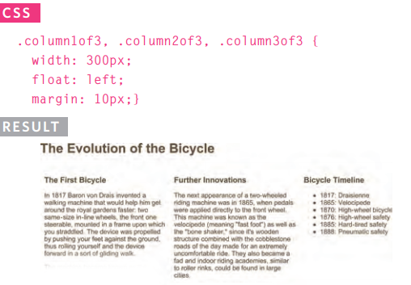

# LAYOUT -CSS

### **-Key Concepts in Positioning Elements**

CSS treats each HTML element as if it is in its
own box. This box will either be a block-level
box or an inline box.

**[Block-level]** boxes start on a new line and act as the main building blocks of any layout.

Examples : `<h1> 
 <ul> <li>`

 **[inline]** boxes flow between surrounding text.

Examples include: ` <b> <i>`

### **-Containing Elements**

If one block-level element sits inside another block-level element then the outer box is known as the **containing or parent** element.

### **-Controlling the Position of Elements**

CSS has the following **positioning** schemes that allow you to control the layout of a page:

**1. Normal flow** : Every block-level element appears on a new line, causing each item to appear lower down the page than the previous one. 

This is the default behavior (unless you tell the browser to do something else).

**2. Relative Positioning** : This moves an element from the position it would be in normal flow, shifting it to the top, right, bottom, or left of where it would have been placed.

**3. Absolute positioning** : This positions the element in relation to its containing element. It is taken out of normal flow, meaning that it does not affect the position of any surrounding elements.

To indicate where a box should be positioned, you may also need to use box offset properties to tell the browser how far from the top or bottom and left or right it should be placed.

**Fixed Positioning** This is a form of absolute
positioning that positions the element in relation to the browser window, as opposed to the containing element.

**Floating Elements** Floating an element allows
you to take that element out of normal flow and position it to the far left or right of a containing box.

> **Note** : When you move any element from normal flow, boxes can overlap. The **z-index** property allows you to control which box appears on top.

## **Overlapping Elements** : z-index

If you want to control which element sits on top, you can use the z-index property. Its value is a number, and the higher the number the closer that element is to the front. **For example**, an element with a z-index of 10 will appear over the top of one with a z-index of 5.

## **Floating Elements** float

The float property allows you to take an element in normal flow and place it as far to the left or right of the containing element as possible. Anything else that sits inside the containing element will flow **around** the element that is floated.

> **Note** : When you use the float property, you should also use the width property to indicate how wide the floated element should be

## **Clearing Floats** : clear

The clear property allows you to say that no element (within the same containing element) should touch the left or righthand sides of a box. It can take the following values: **left, right, both, none.**

## Creating Multi-Column Layouts with Floats

The following three CSS properties are used to position the columns next to each other:

1. **`Width`** This sets the width of the columns.
2. **`Float`** This positions the columns next to each other.
3. **`Margin`** This creates a gap between the columns.

## **Screen Sizes**

Different visitors to your site will have different sized screens that show different amounts of information, so your design needs to be able to work on a range of different sized screens.

most operating systems allow users to adjust the resolution of their screens.

web designers often try to create pages of around 960-1000 pixels wide (since most users will be able to see designs this wide on their screens).

* **Fixed Width Layouts** designs do not change size as the user increases or decreases the size of their browser window. Measurements tend to be given in **pixels**.

* **Liquid Layouts**  designs stretch and contract as the user increases or decreases the size of their browser window. They tend to use **percentages**.

## **Multiple Style Sheets** : @import , link

There are two ways to add multiple style sheets to a page:

1. Your HTML page can link to one style sheet and that stylesheet can use the @import rule to import other style sheets.

    `@import url("style.css");`

2. In the HTML you can use a separate `<link>` element for each style sheet.

    `<link rel="stylesheet" href="css/styles.css"/>`

 

**Article sources**

* HTML & CSS Design and Build Websites / Jon Ducket

**Go back -->** [Reading Notes](https://aseel-dweedar.github.io/reading-notes/)