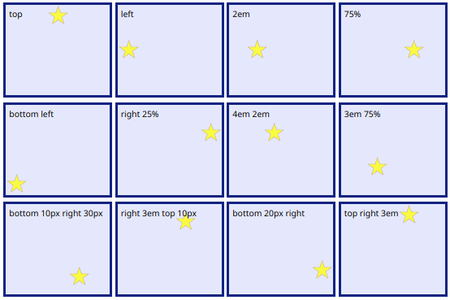
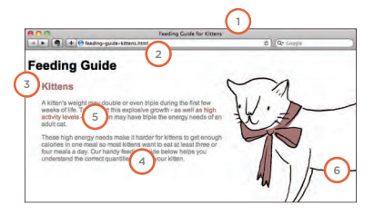
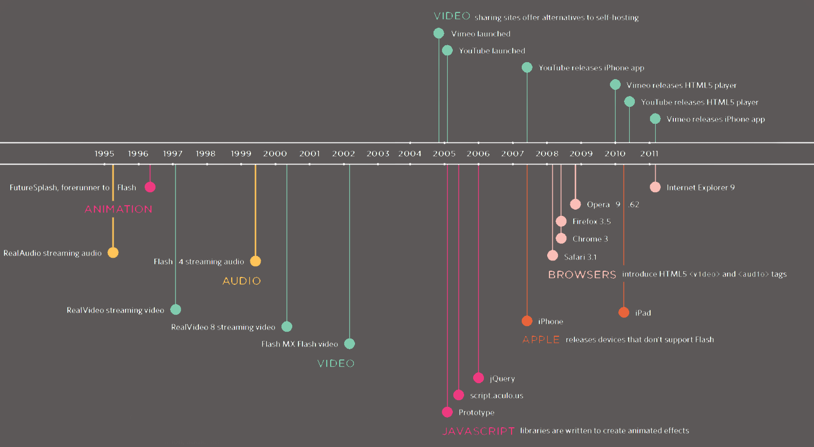

# IMAGES -CSS

### Controlling sizes of images in CSS :

By using **"width, height"** property, with **percentage** or **Pixels** :
``` CSS
img {
width: 100px;
height: 100px;
} 

img {
width: 25%;
height: 30%;
} 
```
### Aligning images Using CSS :

You can use float property move an image to the left or the right .

`float: left;` OR `float: right;`

### Centering images Using CSS :

By default, images are inline elements. In order to center an image, it should be turned into a blocklevel element. there are two common ways in which you can horizontally center an image:

1. On the containing element, you can use the **text-align** property with a value of **center**.
2. On the image itself, you can use the **margin** property and set the values of the left and right margins to **auto**.

## BACKGROUND IMAGES :

place an image behind any HTML element:

``` CSS
body {
background-image: url("images/backgrounds.png");
}
```
### Repeating Images

The background-repeat property can have four values:

1. repeat : The background image is repeated both horizontally and vertically .

    `background-repeat: repeat;`

2. repeat-x : The image is repeated horizontally only.

    `background-repeat: repeat-x;`

3. repeat-y : The image is repeated vertically only.

    `background-repeat: repeat-y;`

4. no-repeat : The image is only shown once.

    `background-repeat: no-repeat;`


**FIXED** The background image stays in the same position on the page. **SCROLL** The background image moves up and down as the user scrolls up and down the page.
`background-attachment: fixed;` OR `background-attachment: scroll`

### Background Position

if the background was not repeated you can control its Position:



## IMAGES ROLLOVERS & SPRITES

To create a link or button that changes to a second style when a user moves their mouse over it (known as a **ROLLOVER**) and many other style when they click on it, 
This is achieved by setting a background image for the link or button that has other different styles of the same button (but only allows enough space to show one of them at a time).

When a single image is used for several different parts of an interface, it is known as a **SPRITE**. 

<br>

# PRACTICAL INFORMATION

### Search Engine Optimization (SEO) :

is the practice of trying to help your site appear nearer the top of search engine results when people look for the topics that your website covers.

They also consider how many sites link to you. For this reason, SEO is often split into two areas, on-page techniques and off-page techniques.

## - On-Page SEO

In every page of your website there are seven key places where keywords can appear in order to improve its findability.



1. Page Title
2. URL / Web Address
3. Headings
4. Text
5. Link Text
6. Image Alt Text
7. Page Descriptions


**How to Identify Keywords and Phrases**

1: **Brainstorm** : List down the words that
someone might type into Google to find your site. 

2: **Organize** : Group the keywords into separate lists for the different sections or categories of your website.

3: **Research** : There are several tools that let you enter your keywords and then they will suggest additional keywords you might like to consider

4: **Compare** :Some of the keyword research sites can tell you how many people have searched for a specific keyword to help you know how much competition those terms have.

5: **Refine** : pick which keywords you will focus on.
> KEYWORDS should always be the ones that are most relevant to each section of your site.

6: **Map** : Pick 3-5 keywords or phrases that map to each page of your website and use these as the keywords for each page.

## ANALYTICS :

As soon as people start coming to your site, you can start Learning about your Visitors:
<b>
* How Many People Are Coming to Your Site?
* What Are Your Visitors Looking At?
* Where Are Your Visitors Coming From?
</b>

One of the best tools for doing this is a free service offered by Google called Google Analytics.

## Domain Names & Hosting

In order to put your site on the web you will need a domain name and web hosting.

|**DOMAIN NAMES** | **WEB HOSTING**|
|--|--|
|your web address|upload your site to a web server|

<br>

# Flash, VidEo & Audio

## Timeline:


## HTML5 video and audio

The `<video>` and `<audio>` elements allow us to embed video and audio into web pages.

``` HTML
<video controls>
  <source src="Play.mp4" type="video/mp4">
</video>
```
the most interesting attribute is **CONTROLS**, If this attribute is present, the browser will offer controls to allow the user to control video playback, including volume, seeking, and pause/resume playback.

## The HTMLMediaElement API

provides features to allow you to control video and audio players programmatically. This interface is available to both `<audio>` and `<video>` elements.

``` html
<button class="play" data-icon="P" aria-label="play pause toggle"></button>

<button class="stop" data-icon="S" aria-label="stop"></button>

<button class="rwd" data-icon="B" aria-label="rewind"></button>

<button class="fwd" data-icon="F" aria-label="fast forward"></button>
```

We have four buttons, **play/pause, stop, rewind, and fast forward**. a `data-icon` attribute for defining what icon should be shown on each button.

and an `aria-label` attribute to provide an understandable description of each button, since we're not providing a human-readable label inside the tags.

## Exploring the CSS

**controls styling tips :**

* visibility of the custom controls set to hidden. In  JavaScript, set the controls to visible, and remove the controls attribute from the `<video>` element. if the JavaScript doesn't load for some reason, users can still use the video with the native controls.

    `visibility: hidden;`

* give the controls an opacity of 0.5 by default, so that they are less distracting. Only when you are hovering/focusing over the player do the controls appear at full opacity.

    `opacity: 0.5;`

**button icons tips :**

* We use the `before selector` to display the content before each `<button>` element.

* Using Icon fonts to cutting down on HTTP requests because you don't need to download those icons as image files, great scalability.

## Implementing the JavaScript :

wire up all the buttons to get the controls working. By these steps:

1. creating constants to hold references to all the objects we want to manipulate:

``` JS
document.querySelector('Class nane');
```
2. remove the default browser controls from the video, and make the custom controls visible.

``` JS
media.removeAttribute('controls');
controls.style.visibility = 'visible';
```

3. implement control :

Ex : **to Playing and pausing the video**

``` JS
play.addEventListener('click', pPmedia);


function pPmedia() {
  if(media.paused) {
    play.setAttribute('data-icon','u');
    media.play();
  } else {
    play.setAttribute('data-icon','P');
    media.pause();
  }
}
```

***`<audio>` elements have the same HTMLMediaElement functionality available to them, you could easily get this player to work for an `<audio>` element too.***


<hr>
<br>

**Article sources**

* HTML & CSS Design and Build Websites / Jon Ducket

* Video and Audio APIs / MDN Web Cocs

**Go back -->** [Reading Notes](https://aseel-dweedar.github.io/reading-notes/)