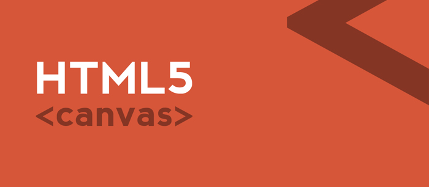
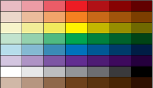
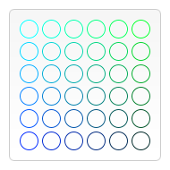

# CANVAS



## The `<canvas>` element

The HTML `<canvas>` element is used to draw graphics, on the fly, via JavaScript.

It has only two attributes, **width** and **height**. These are both optional and can also be set using DOM properties.

> When no width and height attributes are specified, the canvas will initially be 300 pixels wide and 150 pixels high.

The **id attribute** isn't specific to the `<canvas>` element but is one of the global HTML attributes which can be applied to any HTML element. It is always a good idea to supply an id because this makes it much easier to identify it in a script.

## Fallback content

The `<canvas>` element differs from an `` tag in that, like for `<video>, <audio>, or <picture>` elements, just insert the alternate content inside the `<canvas>` element. it also **Required `</canvas>` tag.**

## The rendering context

The `<canvas>` element creates a fixed-size drawing surface that exposes one or more **rendering contexts**, which are used to create and manipulate the content shown.

The canvas is initially blank. To display something, a script first needs to access the rendering context and draw on it. has a method called **`getContext()`**, used to obtain the rendering context and its drawing functions.

```JS
lwt canvas = document.getElementById('test');
let x = canvas.getContext('2d');
```

## Checking for support

```JS
lwt canvas = document.getElementById('test');
if (canvas.getContext) {
    let x = canvas.getContext('2d');
  // drawing code here
} else {
  // canvas-unsupported code here
}
```

## Drawing shapes with canvas

**The grid** :
HTML skeleton from the previous page had a canvas element **150 pixels wide and 150 pixels high**.The origin of the grid is positioned in the top left corner at coordinate (0,0). All elements are placed relative to this origin.


## Drawing rectangles

There are three functions that draw rectangles on the canvas:

- `fillRect(x, y, width, height)` : Draws a filled rectangle.
- `strokeRect(x, y, width, height)` : Draws a rectangular outline.
- `clearRect(x, y, width, height)` : Clears the specified rectangular area, making it fully transparent.

## Drawing paths

A path is a list of points, connected by segments of lines that can be of different shapes, curved or not, of different width and of different color.

**To make shapes using paths:**

1. beginPath() : Creates a new path.
2. Path methods : to set different paths for objects.
3. closePath() : Adds a straight line to the path, going to the start of the current sub-path.
4. stroke() : Draws the shape by stroking its outline.
5. fill() : Draws a solid shape by filling the path's content area.

For example to Drawing a triangle:

```JS
let triangle = canvas.getContext('2d');
    triangle.beginPath();
    triangle.moveTo(75, 50);
    triangle.lineTo(100, 75);
    triangle.lineTo(100, 25);
    triangle.fill();
```

## Moving the pen

We could also use moveTo() to draw unconnected paths.

`moveTo(x, y)`
Moves the pen to the coordinates specified by x and y.

## Lines

For drawing straight lines, use the lineTo() method.

`lineTo(x, y)`

## Arcs

To draw arcs or circles, we use the `arc() or arcTo() methods.`

`arc(x, y, radius, startAngle, endAngle, counterclockwise)`

`arcTo(x1, y1, x2, y2, radius)`

> Note: Angles in the arc function are measured in radians, not degrees.

## Drawing text

The canvas rendering context provides two methods to render text:

`fillText(text, x, y [, maxWidth])`

Fills a given text at the given (x,y) position. Optionally with a maximum width to draw.

`strokeText(text, x, y [, maxWidth])`

Strokes a given text at the given (x,y) position. Optionally with a maximum width to draw.

**Styling text**

- font = value
- textAlign = value
- textBaseline = value
- direction = value

## Applying styles and colors

**A fillStyle**:



**A strokeStyle**



# Chart.js

Charts are far better for displaying data visually than tables and have the added benefit that no one is ever going to press-gang them into use as a layout tool.

start with charts is with **Chart.js**, a JavaScript plugin that uses HTML5’s canvas element to draw the graph onto the page.

## Drawing a line chart

1. create a canvas element in HTML in which Chart.js can draw the chart.

```HTML
<canvas id="buy" width="500" height="300"></canvas>
```

2. write a script that will retrieve the context of the canvas.

```HTML
<script>
    let buy = document.getElementById('buy').getContext('2d');
    new Chart(buy).Line(buyData);
</script>
```

3. Inside the same script, create the data.

```JS
var buyData = {
 labels : ["January","February","March","April","May","June"],
 datasets : [
  {
   fillColor : "rgba(172,194,132,0.4)",
   strokeColor : "#ACC26D",
   pointColor : "#fff",
   pointStrokeColor : "#9DB86D",
   data : [203,156,99,251,305,247]
  }
 ]
}
```

You can also drow :

- Drawing a pie chart

- Drawing a bar chart

<hr>
<br>

**Article sources**

- Basic usage of canvas / MDN

- Drawing shapes with canvas / MDN

- Drawing text / MDN

- Applying styles and colors / MDN

- EASILY CREATE STUNNING ANIMATED CHARTS WITH CHART.JS / SARA VIEIRA

**Go back -->** [Reading Notes](https://aseel-dweedar.github.io/reading-notes/)
