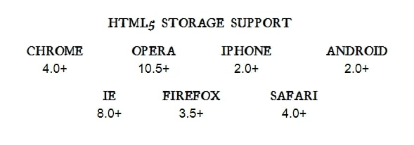

## HTML5 STORAGE

it’s a way for web pages to store named key/value pairs locally, within the client web browser. all previous attempts at providing persistent local storage, it is implemented natively in web browsers, so it is available even when third-party browser plugins are not.

the latest version of pretty much every browser supports HTML5 Storage.



> From your JavaScript code, you’ll access HTML5 Storage through the localStorage object on the global window object. Before you can use it, you should **detect whether** the browser supports it.


## USING HTML5 STORAGE

HTML5 Storage is based on named **key/value pairs**. You store data based on a named key, then you can retrieve that data with the same key. The named key is a string. The data can be any type supported by JavaScript.

> If you are storing and retrieving anything other than strings, you will need to use functions like **parseInt()** or **parseFloat()** to coerce your retrieved data into the expected JavaScript datatype.

you can treat the localStorage object as an associative array:

``` JS
let dStor = localStorage.getItem("bar");
localStorage.setItem("bar", dStor);

// could be rewritten to use square bracket syntax instead:

let dStor = localStorage["bar"];
// ...
localStorage["bar"] = dStor;
```

Also you can remove the value for a given named key, and clear the entire storage area.

### TRACKING CHANGES TO THE HTML5 STORAGE AREA :

The storage event is fired on the window object whenever **`setItem(), removeItem(), or clear()`** is called and actually changes something.

<br>

<hr>
<br>

**Article sources**

* the past, present & future of local storage for web applications /  Mark Pilgrim

**Go back -->** [Reading Notes](https://aseel-dweedar.github.io/reading-notes/)