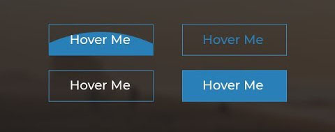
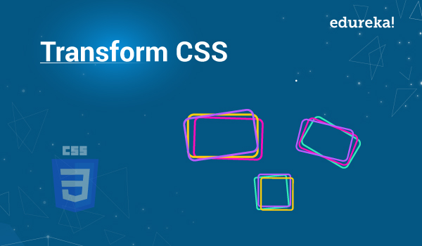

# HOVER -CSS



HOW YOU CAN USE IT TO WOW YOUR USERS :

1. Fade in: coded in two steps: first, you set the initial state; next, you set the change.

```CSS
button {
opacity:0.5;
}
button:hover {
opacity:1;
}
```

2. Change color: for background or text.

```CSS
button:hover {
background:#451287;
}
```

3. Grow & Shrink: to grow increase the scale, to shrink decrease the scale.

```CSS
/*Grow*/
button:hover {
-webkit-transform: scale(1.5);
-ms-transform: scale(1.5);
transform: scale(1.5);
}
/*Shrink*/
button:hover {
-webkit-transform: scale(0.5);
-ms-transform: scale(0.5);
transform: scale(0.5);
}
```

4. Rotate elements:

```CSS
button:hover {
-webkit-transform: rotateZ(-45deg);
-ms-transform: rotateZ(-45deg);
transform: rotateZ(-45deg);
}
```

5. Square to circle: transitioning a square element into a round one, and vice versa.

```CSS
button:hover {
border-radius:50%;
}
```

6. 3D shadow: achieved by adding a box shadow, and then moving the element on the x axis using the transform and translate properties so that it appears to grow out of the screen.

```CSS
button:hover {
box-shadow:
1px 1px #53a7ea,
2px 2px #53a7ea,
3px 3px #53a7ea;
-webkit-transform: translateX(-5px);
transform: translateX(-5px);
}
```

7. Swing: use animation to moves the element left and right, then apply the property:

```CSS
button:hover {
-webkit-animation: swing 2s ease;
animation: swing 2s ease;
-webkit-animation-iteration-count: 1;
animation-iteration-count: 1;
}
```

8. Inset border: transition in a border using an inset box shadow.

```CSS
.border:hover {
box-shadow: inset 0 0 0 25px #53a7ea;
}
```

<br>

# TRANSITIONS & ANIMATIONS


Animations within CSS3 allow the appearance and behavior of an element to be altered in multiple keyframes. Transitions provide a change from one state to another, while animations can set multiple points of transition upon different keyframes.

### **TRANSITIONS**

There are four transition related properties in total, including :

1. Transitional Property: determines exactly what properties will be altered in conjunction with the other transitional properties. only the properties identified within the `transition-property` value will be affected by any transitions.

`transition-property: background, border-radius;`

> It is important to note, not all properties may be transitioned, only properties that have an identifiable halfway point.

2. Transition Duration: The duration in which a transition takes place is set using the transition-duration property.

`transition-duration: .2s, 1s;`

3. Transition Timing: used to set the speed in which a transition will move. Knowing the duration from the transition-duration.
   The linear keyword value identifies a transition moving in a constant speed from one state to another. The ease-in value identifies a transition that starts slowly and speeds up throughout the transition, while the ease-out value identifies a transition that starts quickly and slows down throughout the transition. The ease-in-out value identifies a transition that starts slowly, speeds up in the middle, then slows down again before ending.

`transition-timing-function: linear, ease-in;`

4. Transition Delay: set a delay with the transition-delay property.

`transition-delay: 0s, 1s;`

### **ANIMATIONS**

To set multiple points at which an element should undergo a transition, use the **@keyframes** rule. it includes the animation name, any animation breakpoints, and the properties intended to be animated:

1. Animation Name: The `animation-name` declaration is applied to the element in which the animation is to be applied to.

`animation-name: slide;`

2. Animation Duration: To start, animations need a duration declared using the animation-duration property.

`animation-duration: 2s;`

3. Animation Direction: declare the direction an animation completes using the animation-direction property.

`animation-direction: alternate;`

4. Animation Play State: allows an animation to be played or paused using the `running` and `paused` keyword values respectively.

```CSS
.box:active .ball {
animation-play-state: paused;
}
```

5. Animation Fill Mode: The animation-fill-mode property identifies how an element should be styled either before, after, or before and after an animation is run.

`animation-fill-mode: forwards;`

6. Shorthand Animations: write out the animations in a shorthand format.

```CSS
.stage:hover .box {
  animation: slide 2s ease-in-out .5s infinite alternate;
}
.stage:active .box {
animation-play-state: paused;
}
```

<br>

# TRANSFORMS



The transform property comes in two different settings, two-dimensional and three-dimensional. Each of these come with their own individual properties and values.

### **2D Transforms**

Two-dimensional transforms work on the x and y axes.

1. 2D Rotate: provides the ability to rotate an element from 0 to 360 degrees.

`transform: rotate(20deg);`

2. 2D Scale: allows you to change the appeared size of an element.

`transform: scale(.75);`

3. 2D Translate: works a bit like that of relative positioning, pushing and pulling an element in different directions without interrupting the normal flow of the document.

`transform: translateX(-10px);`

4. 2D Skew: to distort elements on the horizontal axis, vertical axis, or both.

` transform: skewY(-20deg);`

**Combining Transforms**

**To combine transforms, list the transform values within the transform property one after the other without the use of commas.**

**`transform: skew(10deg, 20deg) translateX(20px);`**

5. Transform Origin: the default transform origin is the dead center of an element, both 50% horizontally and 50% vertically. To change this default origin position the transform-origin property may be used.

` transform-origin: 20px 50px;`

6. Perspective: transforming one element from a single to perspective. When you want to transform a group of elements all with the same perspective, or vanishing point, apply the perspective property to their parent element.

` transform: perspective(200px) rotateX(45deg);`

### **3D Transforms**

1. 3D Rotate: rotate an element around any axes. To do so, we use three new transform values, including **rotateX, rotateY, and rotateZ.**

` transform: perspective(200px) rotateZ(45deg);`

2. 3D Scale: elements may be scaled on the z axis.

` transform: perspective(200px) scaleZ(.25) rotateX(45deg);`

3. 3D Translate: Elements may be translated on the z axis.

` transform: perspective(200px) translateZ(50px);`

<hr>
<br>

**Article sources**

- 8 SIMPLE CSS3 TRANSITIONS THAT WILL WOW YOUR USERS
  / SARA VIEIRA

- Transitions & Animations / Learn to Code Advanced HTML & CSS

- Transforms / Learn to Code Advanced HTML & CSS

**Go back -->** [Reading Notes](https://aseel-dweedar.github.io/reading-notes/)
