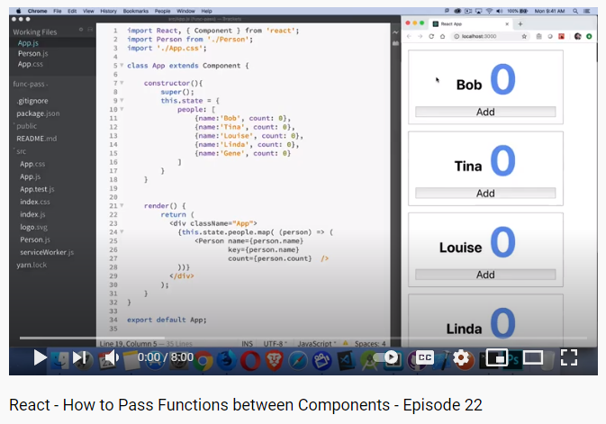

# Lists and Keys

**\*What does .map() return?**

new array with the same length.

**If I want to loop through an array and display each value in JSX, how do I do that in React?**

JSX allows embedding any expression in curly braces.

**Each list item needs a unique -------.**

Key.

**What is the purpose of a key?**

help React identify which items have changed, are added, or are removed.

<hr>
<br>

## How to Use the Spread Operator (…) in JavaScript

**What is the spread operator?**

spread syntax refers to the use of an ellipsis of three dots (…) to expand an iterable object into the list of arguments.

**List 4 things that the spread operator can do.**

1. adding items to arrays.
2. combining arrays or objects.
3. spreading an array out into a function’s arguments.
4. Copying an array.

**Give an example of using the spread operator to combine two arrays.**

```
const arr1 = [1,2,3]
const arr2 = [4,5,6]
const arr3 = [...arr1, ...arr2]
the result of the third array is:
[1,2,3,4,5,6]
```

**Give an example of using the spread operator to add a new item to an array.**

```
const first =[1, 2, 3]
const second = [...first ,4, 5, 6]
the result of the second array is:
[1, 2, 3, 4, 5, 6]
```

**Give an example of using the spread operator to combine two objects into one.**

```
const first = {name: "Aseel"}
const second = {age: "28"}
const third = {...first , ...second , likes: "sleeping"}
the result of the third object is:
{name: "Aseel" , age: "28" , likes: "sleeping"}
```

<hr>
<br>

## How to Pass Functions between Components



**In the video, what is the first step that the developer does to pass functions between components?**

create the function wherever the state is that we're going to change.

**In your own words, what does the increment function do?**

effect a change in one component state from within another component.

**How can you pass a method from a parent component into a child component?**

Just like any other props by add it to the object, then write it in the child class.

**How does the child component invoke a method that was passed to it from a parent component?**

call it like other regulars functions by adding parentheses.

<hr>
<br>

**Article sources**

- Lists and Keys / reactjs.org.
- How to Use the Spread Operator (…) in JavaScript / Dr. Derek Austin .
- React - How to Pass Functions between Components - Episode 22 / Steve Griffith - Prof3ssorSt3v3.

**Go back -->** [Reading Notes](https://aseel-dweedar.github.io/reading-notes/)
