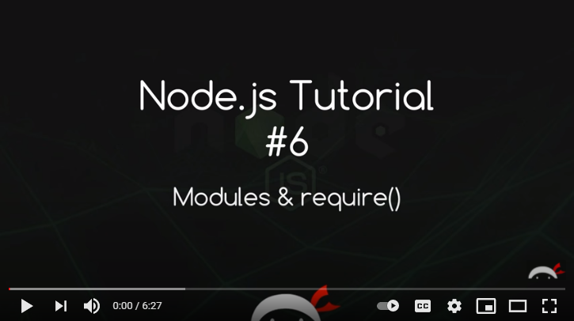

# Functional Programming

### **1. What is functional programming?**

a style of building the structure and elements of computer programs, that treats computation as the evaluation of mathematical functions and avoids changing-state and mutable data.

### **2. What is a pure function and how do we know if something is a pure function?**

stable, consistent, and predictable functions. Given the same parameters, and will always return the same result.

### **3. What are the benefits of a pure function?**

The code’s easier to test.

### **4. What is immutability?**

When data is immutable, its state cannot change after it’s created. If you want to change an immutable object, you can’t. Instead, you create a new object with the new value.

### **.5 What is Referential transparency?**

if a function consistently yields the same result for the same input.

 

# Modules and require()

### **1. What is a module?**

JavaScript file, when we write a node.js application we don't typically dump all of our application code in one file so we split our code up into logical modules.

### **2. What does the word ‘require’ do?**

if we want to use our functionality elsewhere in the application, we use ‘require’ function.

### **3. How do we bring another module into the file the we are working in?**

We have to export it in it's file. then use ‘require’ function to use it in the other file.

### **4. What do we have to do to make a module available?**

We have to export it in it's file.

 

**Sources**

- Concepts of Functional Programming in Javascript / TK.

- Node JS Tutorial for Beginners -Modules and require / The Net Ninja.

**Go back -->** [Reading Notes](https://aseel-dweedar.github.io/reading-notes/)
