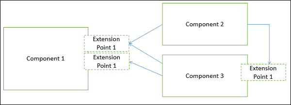
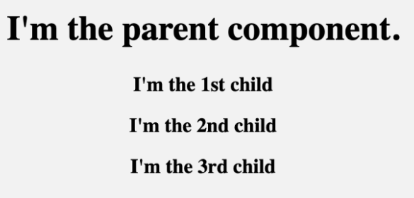

# Component-Based Architecture

* ### **What is a component?**

A component is a modular, portable, replaceable, and reusable set of well-defined functionality that encapsulates its implementation and exporting it as a higher-level interface.

A component can have three different views − **object-oriented view, conventional view, and process-related view.**

* ### **What are the charactistics of a component?**

**Reusability - Replaceable − Not context specific - Extensible −  Encapsulated − Independent.**

A component can extend to other components and still offer its own extension points. It is the concept of plug-in based architecture. This allows a plugin to offer another plugin API.



### **Design Guidelines:**

names meaning --> Extracts the business process entities --> Recognizes these entities as new components --> Models any dependencies --> Model any component.

* ### **What are the advantages of using component based architecture?**


1. Ease of deployment.
2. Reduced cost.
3. Ease of development.
4. Reusable.
5. Modification of technical complexity.
6. Reliability.
7. Easy to change and update the implementation without affecting the rest of the system.
8. Independency and flexible connectivity of components.


<br>


# REACT


React is a component-based library which divides the UI into little reusable pieces. 


* ### **What is props short for?**
“Props” is stands for properties and is being used for passing data from one component to another.

* ### **How are props used in React?**
props used for passing data from one component to another.

> props data is **read-only**, which means that data coming from the parent should not be changed by child components.

how to use Props?
1. define an attribute and its value(data).

```HTML
<ChildComponent text= { “Im the 1st child” } />
```

2. pass it to child component(s) by using Props.

```JS
const ChildComponent = (props) => {  
  return <p>I'm the 1st child!</p>; 
};
```

3. render the Props Data.

```JS
const ChildComponent = (props) => {  
  return <p>{props.text}</p>; 
};
```
***The result is:***


* ### **What is the flow of props?**

> NOTE: that data with props are being passed in a **uni-directional** flow. (one way from parent to child).

<br>

<hr>
<br>

**Article sources**

* Component-Based Architecture /  tutorials point.
* What is “Props” and how to use it in React?
 /  Cem Eygi.

**Go back -->** [Reading Notes](https://aseel-dweedar.github.io/reading-notes/)