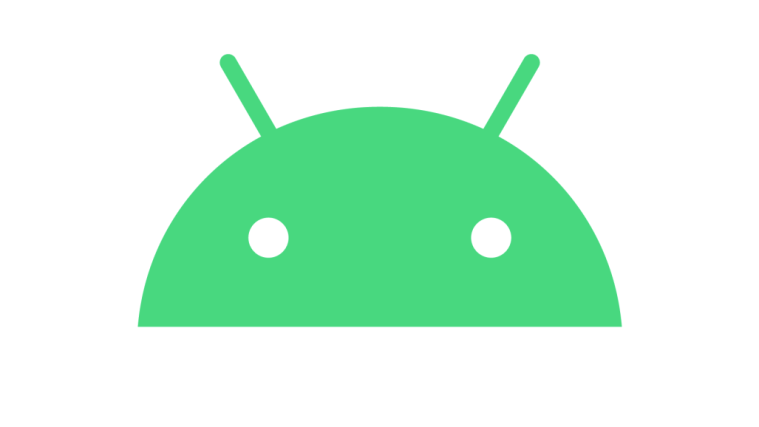

# Android Fundamentals

### [**Application Fundamentals**]

Android apps can be written using Kotlin, Java, and C++ languages.Each Android app lives in its own security sandbox, protected by the following Android security features:

- The Android operating system is a multi-user Linux system in which each app is a different user.

- By default, the system assigns each app a unique Linux user ID.
- Each process has its own virtual machine `(VM)`, so an app's code runs in isolation from other apps.
- By default, every app runs in its own Linux process.

> each app, by default, has access only to the components that it requires to do its work and no more. This creates a very secure environment in which an app cannot access parts of the system for which it is not given permission

### [**App components**]

App components are the essential building blocks of an Android app. There are four different types of app components:

- **Activities**:

  An activity is the entry point for interacting with the user. It represents a single screen with a user interface.

- **Services**:

  A service is a general-purpose entry point for keeping an app running in the background for all kinds of reasons. It is a component that runs in the background to perform long-running operations or to perform work for remote processes.

- **Broadcast receivers**

  A broadcast receiver is a component that enables the system to deliver events to the app outside of a regular user flow, allowing the app to respond to system-wide broadcast announcements.

  > Because broadcast receivers are another well-defined entry into the app, the system can deliver broadcasts even to apps that aren't currently running.

- **Content providers**

  A content provider manages a shared set of app data that you can store in the file system, in a SQLite database, on the web, or on any other persistent storage location that your app can access. Through the content provider, other apps can query or modify the data if the content provider allows it.

### [**Activating components**]

Three of the four component types—activities, services, and broadcast receivers—are activated by an asynchronous message called an **intent**. Intents bind individual components to each other at runtime.

An intent is created with an Intent object, which defines a message to activate either a specific component `(explicit intent)` or a specific type of component `(implicit intent)`.

content providers are not activated by intents. Rather, they are activated when targeted by a request from a **`ContentResolver`**.

### [The manifest file]

The system must know that the component exists by reading the app's manifest file, **`AndroidManifest.xml`**. Your app must declare all its components in this file, which must be at the root of the app project directory.

 

**Sources**

- Application Fundamentals / developer.android DOCUMENTATION.

**Go back -->** [Reading Notes](https://aseel-dweedar.github.io/reading-notes/)
