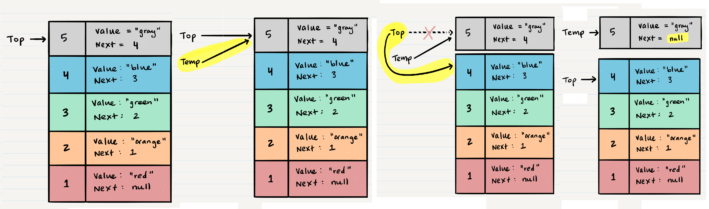

# Stacks and Queues

**What is a Stack**: A stack is a data structure that consists of Nodes. Each Node references the next Node in the stack, but does not reference its previous.

**FILO**: First In Last Out: This means that the first item added in the stack will be the last item popped out of the stack.

**LIFO**: Last In First Out: This means that the last item added to the stack will be the first item popped out of the stack.


**Push O(1)**: Pushing a Node onto a stack will always be an O(1) operation.

When adding a Node, you push it into the stack by assigning it as the new top, with its next property equal to the original top. Let’s walk through the steps:

1. you should have the Node that you want to add.
2. assign the next property of the Node to reference the same Node that is in the top.
3. new Node is added to the stack, but there is no indication that it is the first Node in the stack. To make this happen, you have to re-assign our reference top to the newly added Node.

**Pop O(1)**: removing a Node from the top. When conducting a pop, the top Node will be re-assigned to the Node that lives below and the top Node is returned to the user.



> **NOTE**: check isEmpty before conducting a pop. This will ensure that an exception is not raised.

**Peek O(1)**: inspecting the top Node of the stack.

**IsEmpty O(1)**:

```
ALGORITHM isEmpty()
// INPUT <-- none
// OUTPUT <-- boolean
return top = NULL
```

### Queue:

terminology for a queue is

1. **Enqueue** Nodes or items that are added to the queue.
2. **Dequeue** Nodes or items that are removed from the queue.
   > If called when the queue is empty an exception will be raised.
3. **Front** This is the front/first Node of the queue.
4. **Rear** This is the rear/last Node of the queue.
5. **Peek** When you peek you will view the value of the front Node in the queue.
   > If called when the queue is empty an exception will be raised.
6. **IsEmpty** returns true when queue is empty otherwise returns false.

**Queues follow these concepts:**

**FIFO** First In First Out.

**LILO** Last In Last Out.

**Sources**

- Stacks and Queues / codefellows.

**Go back -->** [Reading Notes](https://aseel-dweedar.github.io/reading-notes/)
