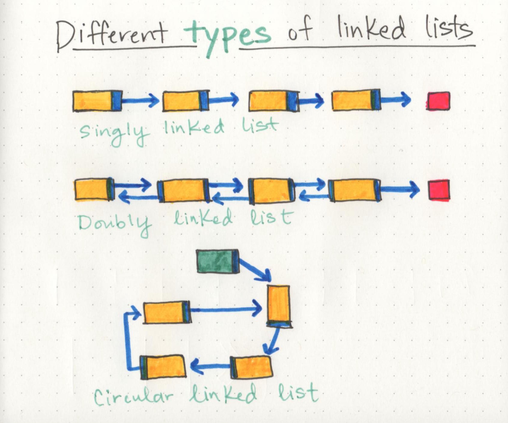

# data structures

which are the different ways that we can organize our data; variables, arrays, hashes, and objects are all types of data structures.

**[Linear data structures]**

means that there is a sequence and an order to how the data are constructed.

**[Memory management]**

When an array is created, it needs a certain amount of memory. we need all of that memory in one contiguous block.
But when a linked list is born, One byte could live somewhere, while the next byte could be stored in another place in memory altogether.

**The fundamental difference between arrays and linked lists is that arrays are static data structures, while linked lists are dynamic data structures.**

# Linked Lists

## What is a Linked List?

A Linked List is a sequence of Nodes that are connected/linked to each other. The most defining feature of a Linked List is that each Node references the next Node in the link.

There are two types of Linked List:

- **Singly** : Refers to the number of references the node has. A Singly linked list means that there is only one reference.

- **Doubly**: refers to there being two (double) references within the node.

- **circular linked list**: it has a node that acts as the tail of the list (rather than the conventional head node), and the node after the tail node is the beginning of the list.

`Head` ---> Reference of type Node to the first node in a linked list.

`Current` ---> Reference of type Node to the node that is currently being looked at.

**[Traversal]**

When traversing a linked list, you are not able to use a foreach or for loop. We depend on the `Next` value in each node to guide us where the next reference is pointing.

> The best way to approach a traversal is through the use of a **while()** loop.

**[Adding a Node]**

**_Big O Notation is a way of evaluating the performance of an algorithm._**

we can add elements and remove elements from a linked list. all
we really need to do is rearrange our pointers.

- Adding O(1): If we want to add a node with an O(1) efficiency, we have to replace the current Head of the linked list with the new node, without losing the reference to the next node in the list.

- Adding a Node O(n): Adding a node to the middle of a linked list is a bit different than adding to the beginning. This is because we are working with more nodes and must re-allocate to make room for the new node.

> NOTE: If you ever find yourself having to do something that requires a lot of traversal, iteration, or quick index-level access, In those situations, an array might be a better solution.

**[Print Out Nodes]**

Creating a **`while`** loop to check and make sure we are not at the end of a linked list. Right before the **`while`** loop restarts, we move **`Current`** to equal the next node in the list.

Once we hit the end, we write out the **`null`** pointed to by the last node (or **`Head`**, if it’s empty).

> **NOTE** : When making your Node class, consider requiring a value to be passed in to require that each node has a value.

 

**Sources**

- Linked Lists / codefellows.

- What’s a Linked List, Anyway? / Vaidehi Joshi.

**Go back -->** [Reading Notes](https://aseel-dweedar.github.io/reading-notes/)
