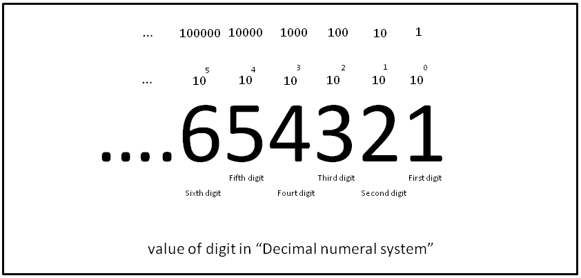

# Object-Oriented Programming Concepts

### **[Object]**

consist of state and related behavior. An object stores its state in fields, and exposes its behavior through methods.
Methods operate on an object's internal state and serve as the primary mechanism for object-to-object communication.

Bundling code into individual software objects provides a number of benefits, including:

- Modularity.
- Information-hiding.
- Code re-use.
- Pluggability and debugging ease.

### **[Class]**

A class is a user defined blueprint or prototype from which objects are created. It represents the set of properties or methods that are common to all objects of one type.

### What Is Inheritance?

Object-oriented programming allows classes to inherit commonly used state and behavior from other classes.

The syntax for creating a subclass: the beginning of your class declaration, use the extends keyword, followed by the name of the class to inherit from:

```java
class Cats extends Animals {
    // new fields and methods defining
    // a cat would go here
}
```

### What Is an Interface?

In its most common form, an interface is a group of related methods with empty bodies. To implement this interface, the name of your class would change, and you'd use the implements keyword in the class declaration:

```java
class Cats implements Animals {
    int age = 0;
    void changeAge(int newValue) {
         age = newValue;
    }
    void printStates() {
         System.out.println("age:" + age);
    }
}
```

### **[Package]**

A package is a namespace that organizes a set of related classes and interfaces. The Java platform provides an enormous class library suitable for use in your own applications. This library is known as the "Application Programming Interface", or "API" for short.

<br>

# Binary, Decimal and Hexadecimal Numbers

## **Decimals**

Every digit in a decimal number has a "position", and the decimal point helps us to know which position is which:



### **[Bases]**

The Decimal Number System is also called "Base 10", because it is based on the number 10, with these 10 symbols:

`0, 1, 2, 3, 4, 5, 6, 7, 8 and 9`

> **NOTE**: there is no symbol for "ten". "10" is actually two symbols put together, a "1" and a "0"

### Counting with Different Number Systems

**General rule** Count up until just before the "Base Number", then start at 0 again, but first you add 1 to the number on your left.

### **[Binary Numbers]**

Binary Numbers are just "Base 2" instead of "Base 10". So you start counting at 0, then 1, then you run out of digits ... so you start back at 0 again, but increase the number on the left by 1.

### **[Hexadecimal Numbers]**

There are 16 of them, a single Hexadecimal digit can show 16 different values instead of the normal 10 like this:

| **Decimal:**     | 0   | 1   | 2   | 3   | 4   | 5   | 6   | 7   | 8   | 9   | 10  | 11  | 12  | 13  | 14  | 15  |
| ---------------- | --- | --- | --- | --- | --- | --- | --- | --- | --- | --- | --- | --- | --- | --- | --- | --- |
| **Hexadecimal:** | 0   | 1   | 2   | 3   | 4   | 5   | 6   | 7   | 8   | 9   | A   | B   | C   | D   | E   | F   |

<hr>
<br>

**Sources**

- Object and Class / Java Documentation.

- Binary, Decimal and Hexadecimal Numbers / mathsisfun.

**Go back -->** [Reading Notes](https://aseel-dweedar.github.io/reading-notes/)
