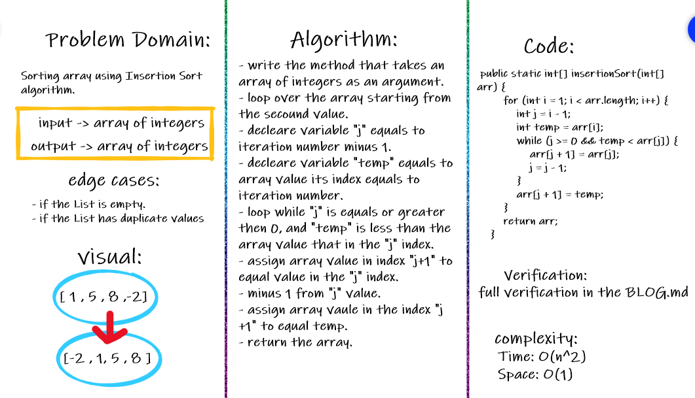
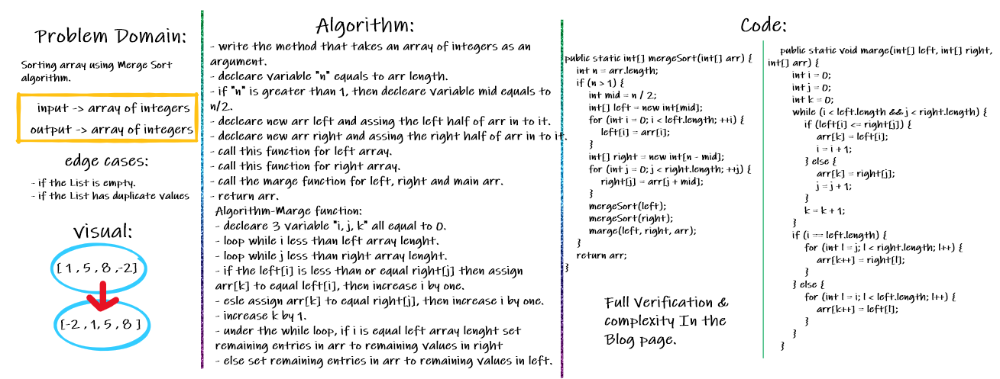
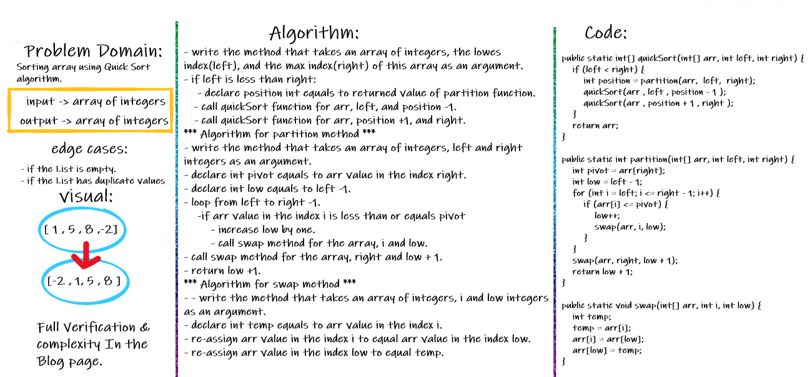

# Insertion Sort

## Challenge Summary

Sorting array using Insertion Sort algorithm.

Document explanation by creating a blog article that shows the step-by-step output after each iteration through some sort of visual.

testing implementation of Insertion Sort based on the pseudocode provided.

## Whiteboard Process

## Approach & Efficiency

for and while loop:

- **Time: `O(n^2)`:**

- **Space: `O(1)`:**

> **Full verification and Efficency in the [BLOG](./BLOG-Insertion.md)**

 

# Merge Sort

## Challenge Summary

Sorting array using Merge Sort algorithm.

Document explanation by creating a blog article that shows the step-by-step output after each iteration through some sort of visual.

testing implementation of Merge Sort based on the pseudocode provided.

## Whiteboard Process

## Approach & Efficiency

for and while loop:

- **Time: `log(n)`:**

- **Space: `O(n)`:**

> **Full verification and Efficiency in the [BLOG](./BLOG-Merge.md)**

 

# Quick Sort

## Challenge Summary

Sorting array using Quick Sort algorithm.

Document explanation by creating a blog article that shows the step-by-step output after each iteration through some sort of visual.

testing implementation of Quick Sort based on the pseudocode provided.

## Whiteboard Process

## Approach & Efficiency

- **Time: `O(n)`:**

- **Space: `O(n)`:**

 

> **Full verification and Efficiency in the [BLOG](./BLOG-quick.md)**
