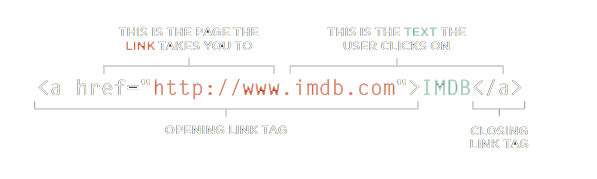
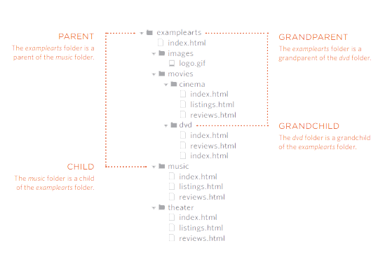

# LINKS -HTML

**Writing Links**

Using the `<a>` element. Users can click on anything
between the opening `<a>` tag and the closing `</a>` tag. specify which page you want to link to using the href attribute.



### **-Linking to Other Sites**

The value of the href attribute will be the full web address for the site, which is known as an absolute URL.

### **-Linking to Other Pages on the Same Site** 

Using a shorthand known as a **relative URL**. If all the pages of the site are in the same folder, then the value of the href attribute is just the name of the file.

### **-Email Links**

Use the `<a>` element.  this time the value of the href attribute starts with **mailto** : and is followed by the email address you want the email to be sent to.

`<a herf-'mailto: Aseel@example.com'>Aseel Email</a>`

### **-Opening Links in a New Window**

Use the target attribute on the opening `<a>` tag. The value of this attribute should be _blank.

`<a href="http://www.ltuc.com" target="_blank">`

### **-Linking to a Specific Part of the Same Page**

Before you can link to a specific part of a page, you need to identify the points in the page that the link will go to. You do this using the id attribute.

To link to an element that uses an id attribute you use the `<a>` element again, but the value of the href attribute starts with the # symbol, followed by the value of the id attribute of the element you want to link to.  example : `<a href="#top">`

### **-Directory Structure**

Organize your code by placing the pages for each different section of the site into a new folder. 




<hr>
<br>

# LAYOUT -CSS

### **-Key Concepts in Positioning Elements**

CSS treats each HTML element as if it is in its
own box. This box will either be a block-level
box or an inline box.

**[Block-level]** boxes start on a new line and act as the main building blocks of any layout.

Examples : `<h1> <p> <ul> <li>`


 **[inline]** boxes flow between surrounding text.

Examples include: ` <b> <i>`

### **-Containing Elements**

If one block-level element sits inside another block-level element then the outer box is known as the **containing or parent** element.

### **-Controlling the Position of Elements**

CSS has the following **positioning** schemes that allow you to control the layout of a page:

**1. Normal flow** : Every block-level element appears on a new line, causing each item to appear lower down the page than the previous one. 

This is the default behavior (unless you tell the browser to do something else).

**2. Relative Positioning** : This moves an element from the position it would be in normal flow, shifting it to the top, right, bottom, or left of where it would have been placed.

**3. Absolute positioning** : This positions the element in relation to its containing element. It is taken out of normal flow, meaning that it does not affect the position of any surrounding elements.


To indicate where a box should be positioned, you may also need to use box offset properties to tell the browser how far from the top or bottom and left or right it should be placed.

**Fixed Positioning** This is a form of absolute
positioning that positions the element in relation to the browser window, as opposed to the containing element.

**Floating Elements** Floating an element allows
you to take that element out of normal flow and position it to the far left or right of a containing box.

> **Note** : When you move any element from normal flow, boxes can overlap. The **z-index** property allows you to control which box appears on top.

<br>


# FUNCTION -JS
**Functions** let you group a series of statements together to perform a specific task. it is like a **store** ; it holds the statements that are contained in the curly braces until you are ready to use them. Those statements are not run until the function is **called** .

**DECLARE A BASIC FUNCRION**

To creat a function, give a name and write the statements needed to achieve its task indide curly braces.

```
finction sayHi() {

document.write('Hi');

}


To CALL the function :

sayHi();
```

**DECLARE AND CALL A FUNCRION THAT NEED INFORMATIONS**


**GITIING A SNGLE VALUE OUT OF FUNCTION**

Some function return inforomation to the code that called them,
```
function area( width , hight ) {
var area = width * hight ;
}

var rec1 = area(2. ,4)
var rec1 = area(3. ,7)
```

**GITIING MULTIPLE VALUE OUT OF FUNCTION**

Function can return more than one vale using an array.

```
function getSize(width, hight, depth) {
var area = width *  hight
var voleme = width * hight * depth
var size = [area, volum]
}
var areaOne = getSize ( 2, 5, 7)[0];
var areaTwo = getSize ( 2, 5, 7)[1];
```

**LOCAL VARIABLES**
When a variable is created inside a function using the
var keyword, it can only be used in that function. 

**GLOBAL VARIABLES**
If you create a variable outside of a function, then it
can be used anywhere within the script. It is called a
global variable and has global scope.
<hr>
<br>

 # 6 Reasons for Pair Programming


  pair programming is the practice of two developers sharing a single workstation to interactively tackle a coding task together.commonly involves **two roles**:
   1. The Driver is the programmer who is typing and the only one whose hands are on the keyboard.
   2. The Navigator uses their words to guide the Driver but does not provide any direct input to the computer.

   Pair programming touches on all four **skills**: developers explain out loud what the code should do, listen to others’ guidance, read code that others have written, and write code themselves.

**- Reasons for Pair Programming:**

1. **Greater efficiency:** when two people focus on the same code base, it is easier to catch mistakes in the making. produces higher-quality code that doesn’t require later effort in troubleshooting and debugging.two programmers may come to a solution faster than one programmer on their own.

2. **Engaged collaboration:** the experience is more engaging and both programmers are more focused than if they were working alone. When developers pair program, they rely more on each other and can often find a solution together without needing to ask for additional help. Ultimately, this boosts overall confidence.

3. **Learning from fellow students**: If one developer has a unique approach to a specific problem, pair programming exposes the other developer to a new solution. If one programmer is more experienced in a certain skill, they can teach a student who is less familiar with that area.

4. **Social skills:**  Pair programming not only improves programming skills, but can also help programmers develop their interpersonal skills.  As much as employers want strong programmers, they know it’s essential to hire people who can work well with others.

5. **Job interview readiness:**  the ability to work with and learn from others and stellar communication skills are as (or more!) important to a company than specific technical skills.

6. **Work environment readiness:** who already familiar with how pairing works can running at a new job, with one less hurdle to overcome.


<hr>
<br>

**Article sources**

* HTML & CSS Design and Build Websites / Jon Ducket

* JavaScript and jQuery Interactive / Jon Ducket

* 6 Reasons for Pair Programming / Allie Grampa

**Go back -->** [Reading Notes](https://aseel-dweedar.github.io/reading-notes/)