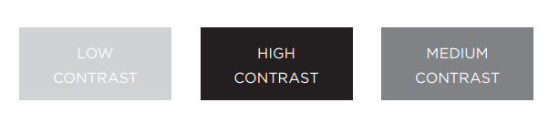

# IMAGES -HTML


## --> Adding Images
To add an image into the page you need to use an `` element. It must carry the following two attributes:
* **src** : This tells the browser where it can find the image file (Image adress or phat).
* **alt** : This provides a text description
of the image which describes the image if you cannot see it.

EX : ``

## --> Attributes can be used with ``

* **title attribute** to provide additional information
about the image. Most browsers will display the content of this attribute in a tootip when the user hovers over the image.

* **height**  This specifies the height of the image in pixels.

* **width** This specifies the width of the image in pixels.

## --> Three Rules for Creating Images

1. Save images in the right **format**.
2. Save images at the right **size**.
3. Use the correct **resolution**.

> We will talk about image format later on this article.

## --> Image Dimensions
The images you use on your website should be saved at the same width and height that you want them to appear on the page.

***You can't increase the size of photos significantly without affecting the image quality.***

## --> Figure and Figure Caption

`<figure>` ues to contain images and their caption
so that the two are associated. 

`<figcaption>` use to allow web page authors to add
a caption to an image.

<br>

# JPEG vs PNG vs GIF 


## --> JPEG :
Use JPEG format for all images that contain a natural scene or photograph where variation in colour and intensity is smooth.

## --> PNG :
Use PNG format for any image that needs transparency or for images with text & objects with sharp contrast edges like logos. 

## --> GIF :
GIF images are now mainly used only if the image contains animations.


## Transparency & Color :

**JPEG** images don’t support transparency and are hence not usable for such cases.

**PNG** images support transparency in two ways — inserting an alpha channel that allows partial transparency or by declaring a single colour as transparent.

**GIF** images support transparency by declaring a single colour in the colour palette as transparent. -**GIF is unsuitable for images with transparent backgrounds.**-


|JPEG|PNG|GIF|
|--|--|--|
|support around 16 million|PNG8 support upto 256 colours<br>PNG24 upto 16 million|limited to 256 colours|

<br>

# COLOR -CSS

Every color on a computer screen is created by mixing amounts of red, green, and blue. To find the color you want, you can use a color picker.
**You can specify any color in CSS in one of three ways:**

1. **rgb values** These express colors in terms of how much red, green and blue are used to make it up. For
example: rgb(100,100,90)

2. **hex codes** These are six-digit codes that represent the amount of red, green and blue in a color,
preceded by a pound or hash # sign. For example: #ee3e80

3. **color names** There are 147 predefined color names that are recognized by browsers. For example: DarkCyan.
<hr>

**properties can be added to the colors :**

1. **Hue** : the degree to which a stimulus can be described as similar to or different from stimuli that are described as red, orange, yellow, green, blue, purple.
2. **Saturation** : refers to the amount of gray in a color. 
3. **Brightness** : how much black is in a color.


4. **Contrast** : If text is reversed out (a light color on a dark background), you can increase the height between lines and the weight of the font to make it easier to read.



5. **opacity, rgba** : allows you to specify the opacity of an element and any of its child elements. The value is a number between 0.0 and 1.0.

```
p.one {
background-color: rgb(0,0,0);
opacity: 0.5;}
```
**OR**
```
p.two {
background-color: rgba(0,0,0,0.5);}

OR : USING hsla
background-color: hsla(0,100%,100%,0.5);}
```

<br>

# TEXT -CSS


### **Typeface Terminology** :

-**Serif** : have extra details on the ends of the main strokes of the letters. These details are known as serifs.

-**Sans-Serif** : have straight ends to letters, and therefore have a much cleaner design.

-**Monospace** : Every letter in a monospace font is the same width.


***browser usually only display the typeface if it's installed on the user's computer.***

<hr>

## properties can be added to the text :

* Font Size : `font-size: 12px;`
* Font wight (Normal, Bold): <br>  `font-weight: bold;`
* Font style (Normal, Italic, oblique) : <br> `font-style: italic;` 
* UpperCase & LowerCase :
    * **uppercase** This causes the text to appear uppercase. <br> `text-transform: uppercase;`
    * **lowercase** This causes the text to appear lowercase. <br> `text-transform: lowercase;`
    * **capitalize** This causes the first letter of each word to appear capitalized. <br> `text-transform: capitalize;`
* Underline & Strike:
    * none : This removes any decoration already applied to the text.
    * underline : This adds a line underneath the text.
    * overline : This adds a line over the top of the text.
    * line-through : This adds a line through words. blink.
    * blink : This animates the text to make it flash on and off.

    EX :`text-decoration: none;`
* Leading : vertical space between lines of text. <br> `line-height: 1.4em;`
* Letter & Word Spacing :
    * word-spacing : `word-spacing: 1em;`
    * letter-spacing : `letter-spacing: 0.2em;`
* Alignment : (left, Right, justify, Center) : <br> `text-align: justify;`
* Vertical Alignment : `vertical-align: text-top;`
* Indenting Text : allows you to indent the first
line of text within an element. <br> `text-indent: 20px;`
* Drop Shadow : `text-shadow: 2px 2px 7px #111111;`
* First Letter or Line : You can specify different values for the first letter or first line of text inside an element using :first-letter and first-line.  
```
p.intro:first-letter {
font-size: 200%;}
```


<hr>
<br>

**Article sources**

* HTML & CSS Design and Build Websites / Jon Ducket

* JPEG vs PNG vs GIF — which image format to use and when? / Rahul Nanwani

**Go back -->** [Reading Notes](https://aseel-dweedar.github.io/reading-notes/)