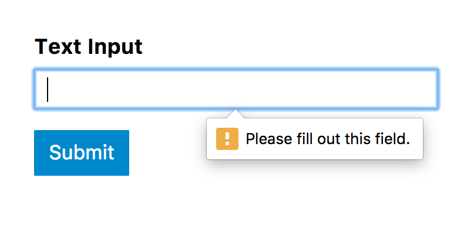

# Forms -HTML


There are several types of form controls that
you can use to collect information from visitors
to your site:

- ADDING TEXT:
    * Text input
    * Password input
    * Text area
- Making Choices:
    * Radio buttons
    * Checkboxes
    * Drop-down boxes 
- Submitting Forms:
    * Submit buttons
    * Submit buttons
- Uploading Files.

## How Forms Work?

1. A user fills in a form and then presses a button
to submit the information to the server.
2. The name of each form control is sent to the server along with the value the user enters or selects.
3. The server processes the information using a programming language.
4. The server creates a new page to send back to the browser based on the information received.

## Form Structure 

Form controls live inside a `<form>` element. This element should always carry the **action attribute** and will usually have a **method** and **id attribute** too.

``` HTML
<form action="http://www.example.com/subscribe.php"
method="get">
<p>This is where the form controls will appear.
 </p>
</form>
```

## Input

|Input|Tag|Type|attribute|
|--|--|--|--|
|Text Input|`<input>`|"text"|name, size, maxlength|
|Password Input|`<input>`|"password"|name, size, maxlength|
|Text Area|`<textarea>`|-|name, col, row|
|Radio Button|`<input>`|"radio"|name, value, checked|
|Checkbox|`<input>`|"checkbox"|name, value, checked|
|Drop Down List Box|`<select>`<br>`<option>`|-|(`<select>`) name<br>(`<option>`) value, selected|
|Multiple Select Box|`<select>`|-|size, multiple|
|File Input Box|`input>`|"file"|name|
|Submit Button|`<input>`|"submit"|name, value|
|Image Button|`<input>`|"image"|width, height|
|Button|`<button>`|-|width, height|
|hidden Controls|`<input>`|"hidden"|name, value|
|Labele|`<label>`|-|for|
|Article|`<input>`|"date"|name|
|Email|`<input>`|"email"|name|
|URL|`<input>`|"url"|name|
|search input|`<input>`|"search"|name, placeholder|

<hr>

## Grouping Form Elements
You can group related form controls together inside the
`<fieldset>` , The `<legend>` element can come directly after the opening `<fieldset>` tag and contains a caption which helps identify the purpose of that group of form controls.

## Form Validation

Validation helps ensure the user enters information in a form that the server will be able to understand when the form is submitted. 



<br>

# Lists -CSS

## Bullet Point Styles

The **`list-style-type`** property in **CSS** allows you to control the shape or style of a bullet point (also known as a marker). 

```
For example:

ol {
list-style-type: upper-roman;}

numbering will be like: (I, II, III, IV, V, etc.)
```
## Images for Bullets
`list-style-image: url("images.png");`

## Positioning the Marker
Lists are indented into the page by default and the `list-style-position` property indicates whether the marker should appear on the inside or the outside of the box containing the main points. 

## List Shorthand
`list-style` This property acts as a shorthand for list styles. it allows you to expressthe markers' style, image and position properties in any order

<br>

# Tables -Css

##  Table Properties

there are already met several properties that are commonly used with tables, such as width, text-align, Give cells padding, Align numerals, and a lot of other Properties that you can search for.

**Border on Empty Cells**

 you can use the `empty-cells` property when you have an empty cell to specify whether or not their borders should be shown. It can take one of three values:
* **show** This shows the borders of any empty cells.
* **hide** This hides the borders of any empty cells.
* **inherit** If you have one table nested inside another, the inherit value instructs the table cells to obey the rules of the containing table.

**Gaps Between Cells**

By using:

`border-collapse: collapse;` Borders are collapsed into a single border where possible.

`border-spacing: ;` Borders are detached from each
other.


# Forms -CSS

CSS is commonly used to control the appearance of form elements. This is both to make them more attractive and tomake them more consistent across different browsers.

## What can you style?
- **Styling Text Inputs:** font-size, color, background-color, border, border-radius, focus, hover, background-image.

- **Styling Submit Buttons:** color, text-shadow, border-bottom, background-color, hover.

- **Styling Fieldsets & Legends:** width, color, background-color, border, border-radius, padding.

- **Algning Form Controls.**

- **Cursor Styles:** control the type of mouse
cursor that should be displayed to users by using `cursor` property: auto, crosshair, default, pointer, move, text, wait, help, url("cursor.gif");

<br>

# EVENT -JS

## HOW EVENTS TRIGGER JAVASCRIPT CODE?

When the user interacts with the HTML on a web page, there are three steps involved in getting it to trigger some JavaScript code. Together these steps are known as event handling:

1. Select t he element node(s) you want the script to respond to. 
2. Indicate which event on the selected node(s) will trigger the response. Programmers call this binding an event to a **DOM** node.
3. State the code you want to run when the event occurs.

## BIND AN EVENT TO AN ELEMENT

TRADITIONAL DOM EVENT HANDLERS:

All modern browsers understand this way of creating an event handler, but you can only attach one function to each event handler.


## EVENT LISTENERS

Event listeners are a more recent approach to handling events. They can deal with more than one function at a time but they are not supported in older browsers. 


``` js
let  elUsername = document .getElementByid('username') ;
let  el Msg = document .getElementByid('feedback') ;

function checkUsername(minlength) { 
if (elUsername.value.length < minlength) {
elMsg .textContent = 'Username must be ' + minlength + ' characters or more'; 
} else {
elMsg . innerHTML
} 
}

elUsername. addEventListener('bl ur' , function() {
checkUsername (S); 
}, false) ; 
```

**Article sources**

* HTML & CSS Design and Build Websites / Jon Ducket

* JavaScript and jQuery Interactive / Jon Ducket

**Go back -->** [Reading Notes](https://aseel-dweedar.github.io/reading-notes/)