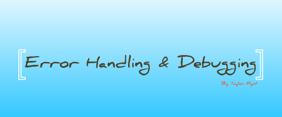
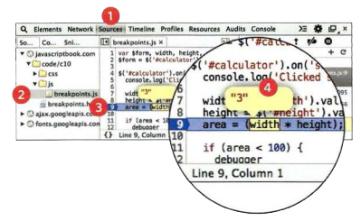

# ERROR HANDLING & DEBUGGING

## EXECUTION CONTEXTS
Every statement in a script lives in one of three
execution contexts:
 
* GLOBAL CONTEXT : Code that is in the script, but not in a function. There is only one global context in any page.
* FUNCTION CONTEXT : Code that is being run within a function.

**VARIABLE SCOPE** : If a variable is declared outside a function, it can be used anywhere because it has global scope.  If you do not use the var keyword when creating a variable, it is placed in global scope.

##  HOISTING 

The preparation phase is often described as taking all of the variables and functions and hoisting them to the top of the execution context.
Each execution context also creates its own variables object. This object contains details of all of the variables, functions, and parameters for that execution context.

## OBJECTS ERRORS
If a JavaScript statement generates an error, then it throws an exception. At that point, the interpreter stops and looks for exception-handl ing code. 

There are seven types of built-in error objects in
JavaScript:
1. **Syntax Error:**
This is caused by incorrect use of the rules of the
language. It is often the result of a simple typo.

Ex : `document .write ("Howdyl );`

Syntax Error: MISMATCHING OR UNCLOSED QUOTES

2. **ReferenceError** : This is caused by a variable that is not declared or is out of scope. 

Ex :
``` JS
let a = 12 ;
let area = a * b ;
```
ReferenceError: Can't find variable: "b". 

3. **Type Error** : This is often caused by trying to use an object or method that does not exist.

Ex : `document. Write('Name');`
TypeError: 'undefined' is not a function. (INCORRECT CASE "W")

4. **RangeError** : If you call a function using numbers outside of its accepted range.

Ex : `var anArray = new array(-1); `
RangeError: Array size is not a small lenough positive integer.

5. **EvalError** : 
INCORRECT USE OF eval() FUNCTION
The eval () function evaluates text through the
interpreter and runs it as code.

6. **URL Error** : If these characters are not escaped in URls, they will cause an error: `/ ? & I : ;`

7. **Error** : The generic Error object is the template from which all other error objects are created. 

## HOW TO DEAL WITH ERRORS 

1. DEBUG THE SCRIPT TO FIX ERRORS : you will need to
debug the code, track down the source of the error,
and fix it.

2. 2: HANDLE ERRORS GRACEFULLY : You can handle errors gracefully using `try, catch, throw, and finally` statements.

## JAVASCRIPT CONSOLE

The JavaScript console will tell you when there is a problem with a script, where to look for the problem, and what kind of issue it seems to be. 

Browsers that have a console have a console object, which has several methods that your script can use to display data in the console. The object is documented in the Console API.

## WRITING FROM THE SCRIPT TO THE CONSOLE

1. `console.log()` :  write several values to the
console at the same time, each separated by a comma.
2. `conso1e.info()` : can be used for general information.
3. `console.warn()` : can be used for warnings.
4. `console.error()` : can be used to hold errors.

5. `console.group()` : write a set of related data to the console.

6. `console.table()` : lets you output a table showing:
    * objects
    * arrays that contain other objects or arrays 

7. `console.assert()` : test if a condition is met, and write to the console only if the expression
evaluates to false. 

## BREAKPOINTS 

You can pause the execution of a script on any line using breakpoints. Then you can check the values stored in variables at that point in time.



1. Select the Sources option.
2. Select the script you are working with from the left-hand pane. The code will appear to the right.
3. Find the line number you want to stop on and click on it.
4. When you run the script, it will stop on this line. You can now hover over any variable to see its value at that time in the script's execution.

## DEBUGGER KEYWORD 

You can create a breakpoint in your code using just the debugger keyword. When the developer tools are open, this will automatically create a breakpoint. 

## HANDLING EXCEPTIONS

If you know your code might fail, use `try, catch, and finally`. Each one is given its own code block. 

``` JS
try {
// Try to execute this code
catch (exception) {
// If there is an exception, run this code
fina lly {
// This always gets executed
}
```

<br>
<hr>
<br>

**Article sources**

* JavaScript and jQuery Interactive / Jon Ducket

**Go back -->** [Reading Notes](https://aseel-dweedar.github.io/reading-notes/)